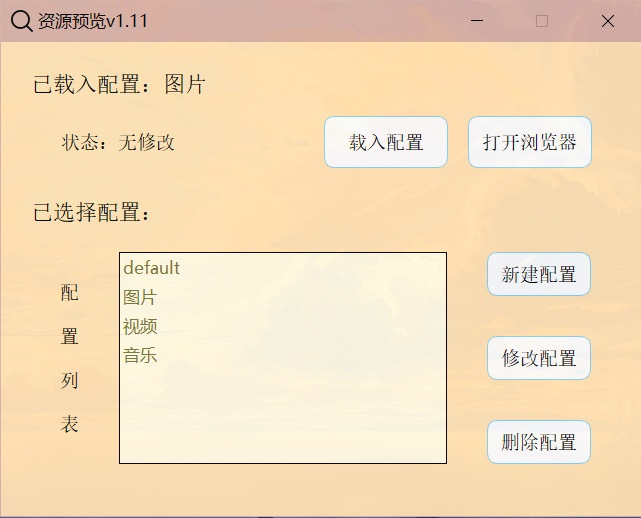
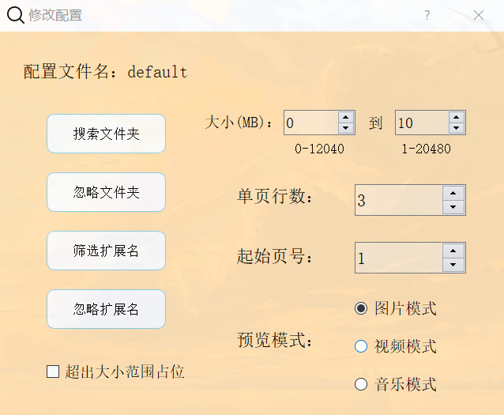
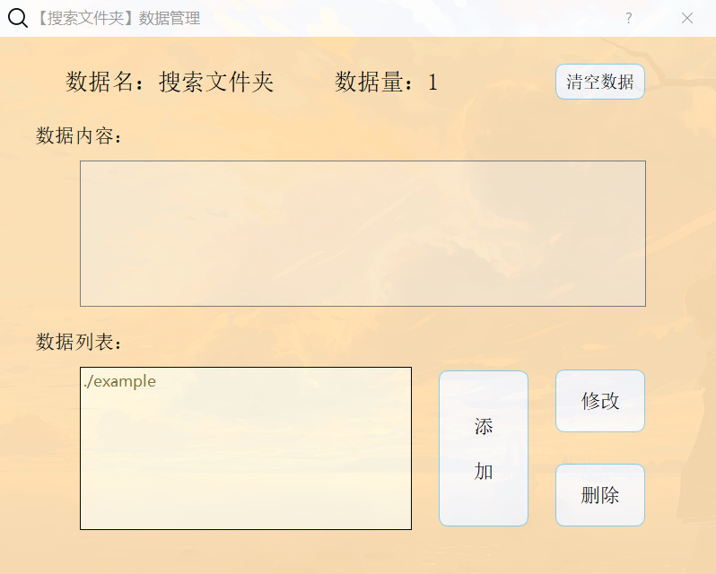

# 一、简介
## 描述：
```
本地资源预览器，目前可预览浏览器支持的图片、视频和音频文件
```
## 原理：
```
检索和条件筛选本地资源绝对路径，将筛选路径和显示配置写入到前端全局变量js文件中用浏览器展示，方便目录较深的本地文件夹内资源的查看
```
# 二、打包后文件夹结构简述
### 文件夹结构
```
项目文件夹
    -->browser
    -->config
        -->history.txt
        -->seting.txt
    -->seting
        -->default
            DirList.txt
            DirIgnore.txt
            ExtList.txt
            ExtIgnore.txt
            OtherSeting.txt
        ...
    -->example
    -->cover
    icon.ico
    main.exe
```
## 文件夹简述
### browser     【前端打包项目】
```
前端vue2项目github地址:   https://github.com/ShenWei-HopeNoBug/srcViewerBrowser    
```
### config      【GUI显示配置存档文件】
```
history.txt     历史记录信息save文件
seting.txt      前端显示配置名save文件
```
### seting      【前端显示配置文件】
```
文件夹名为配置名(默认配置default)
    DirList.txt         筛选文件夹
    DirIgnore.txt       忽略文件夹
    ExtList.txt         筛选扩展名
    ExtIgnore.txt       忽略扩展名
    OtherSeting.txt     前端显示配置
```
##### 前端显示配置OtherSeting.txt内数据储存顺序
    index     data
    1         单页最大行数
    2         起始页码
    3         预览模式(image/video/music)
    4         资源大小筛选下限(MB)
    5         资源大小筛选上限(MB)
    6         资源超出筛选上下限是否占位
### example     【示例文件】
```
该文件夹为新建显示配置的默认搜索文件夹，放了图片、视频和音频的示例文件
```
### cover     【歌曲的封面图】
```
该文件夹用于临时保存解析出来的歌曲封面
```
# 三、GUI界面预览图
## 主界面
```
选择一个配置项，点击【载入配置】，再点击【打开浏览器】
之后会弹出弹窗可以选择打开的浏览器(默认/谷歌/火狐/edge浏览器)
```

## 修改配置主界面
```
在主界面点击【修改配置】会进入该界面
该界面可修改前端显示的配置，搜索和筛选文件的配置
【搜索文件夹】配置要搜索的文件夹路径
【忽略文件夹】配置要忽略的文件夹路径
【筛选扩展名】配置要筛选的扩展名(.jpg之类的)，不配置就是默认搜索所有文件
【忽略文件夹】配置要忽略的扩展名(.jpg之类的)
【超出大小占位】勾选后对于超出筛选大小范围的文件，前端会特殊显示占位
```

## 配置界面
```
在修改配置主界面点击那四个按钮会进入该界面
该界面可以添加一些配置数据
按【添加】按钮会输入弹窗，一次添加多个数据可用回车隔开
```

